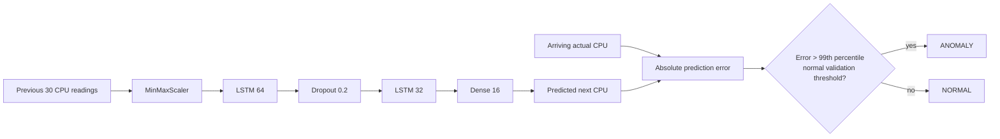

# LSTM-Based Real-Time Time-Series Anomaly Detection System

An interview-friendly Python project that learns *normal* server CPU behavior and flags unexpected next readings from prediction error. It is a genuine prediction-based detector: `is_anomaly` in synthetic data is used only to evaluate results, never as a model input or decision rule.

## Problem and approach

Servers normally exhibit gradual, seasonal CPU patterns. A sudden surge, crash, or sustained overload can signal an operational problem. This is time-series anomaly detection because order and recent context matter. The LSTM receives the previous 30 normalized CPU readings and predicts reading 31. Once reading 31 actually arrives, `absolute_error = |actual - predicted|`; an error above the normal-validation percentile threshold is an anomaly.

Time-series split is chronological, never shuffled. The model trains on the first 60% (normal synthetic behavior); the next 20% is clean validation. The last 20% contains hidden synthetic anomalies. The scaler is fit only on training values, preventing future-data leakage.

## Why LSTM?

An RNN carries a hidden state through a sequence but basic RNNs can forget long patterns because gradients vanish. An LSTM is an RNN with a persistent cell state and gates: the **forget gate** removes irrelevant history; **input gate** selects new information; **cell state** carries useful context; and **output gate** controls what becomes the next hidden state. It is a practical fit for periodic CPU patterns, while still being small enough to explain.

## Architecture



MSE is the training loss: it penalizes larger next-value prediction mistakes. MAE is also reported as an intuitive metric. The threshold is based on normal validation errors instead of a random number: it represents the upper tail of errors the model makes when behavior is known to be normal. Higher percentiles reduce false alerts but can miss smaller anomalies.

## Project structure

```
data/raw/                  generated or user CSVs
models/                    saved Keras model, scaler, metadata
src/data_generator.py      gradual CPU data + test-only labelled anomalies
src/data_loader.py         parsing/validation/cleaning
src/preprocessing.py       chronological split and persisted scaler
src/sequence_builder.py    sliding windows (N values -> next value)
src/model.py               configurable LSTM
src/train.py               training + validation threshold metadata
src/detector.py            prediction error classification
src/evaluation.py          metrics (when labels exist)
src/realtime.py            one-event-at-a-time simulator
app.py                     Streamlit dashboard
```

## Clean setup and commands

```bash
python -m venv .venv
source .venv/bin/activate              # Windows: .venv\Scripts\activate
pip install --upgrade pip
pip install -r requirements.txt
python -m src.data_generator
python -m src.train
python -m src.evaluation
streamlit run app.py
```

For a quicker smoke demo use `python -m src.train --epochs 5`. Run tests with `pytest -q`. In Streamlit, click **Start / continue simulation**: it intentionally processes one new reading per refresh. The prediction is created from the existing window *before* that reading is observed; only then can its error and status be calculated.

## Input data and extension

CSV needs `timestamp,cpu_usage`; optional `is_anomaly` enables evaluation only. Loading parses timestamps, sorts, drops duplicate timestamps, rejects invalid CPU ranges, and handles small missing gaps. Future Memory, Disk, and Network metrics can be added as feature columns: update validation/scaling and change the input feature dimension; the detector pattern remains the same. A REST/IoT/MQTT/Kafka adapter can call `SimulatedRealtimeDetector.step`-equivalent logic after each incoming event.

## Evaluation

When labels are available evaluation prints precision, recall, F1, accuracy, confusion matrix, count, and anomaly percentage. Since anomaly data is imbalanced, accuracy alone is not evidence of a good detector: precision measures alert quality, recall measures found incidents, and F1 balances both.

## Limitations and improvements

This univariate demo assumes normal validation data and a stable baseline. Distribution drift, contaminated training periods, or gradual anomalies can degrade it. Production improvements: monitor error drift and retrain on approved clean data; use robust/seasonal features and multivariate metrics; tune thresholds per service; add alert rate limiting, monitoring, authentication, and a real streaming connector.
